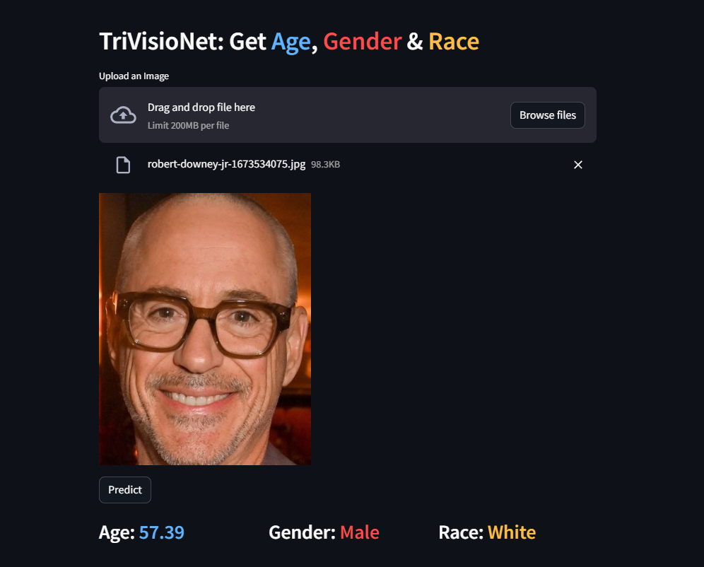

# TriVisioNet: Get Age, Gender and Ethnicity

Trivisionet is a cutting-edge project designed to predict age, gender, and race simultaneously through facial feature analysis. Leveraging the powerful `EfficientNetV2B2` as its feature extractor, Trivisionet achieves remarkable results with a Mean Absolute Error (MAE) of `6.3` for age prediction, while boasting an impressive `92%` accuracy rate for gender classification and a commendable `78%` accuracy for identifying human races. This innovative system showcases the potential of advanced machine learning techniques in accurately analyzing and categorizing diverse demographic attributes from facial images

## 🚀 About Me
👋 Hi there! I'm **Mainak Mukherjee**, a passionate and ambitious B.Tech student with a strong drive to become a Data Scientist and Data Analyst. Welcome to my data-driven journey!

## Python Libraries used

- numpy
- sklearn
- matplotlib
- seaborn
- tensorflow
- tqdm
- os
- time
- random

## Link for the dataset and Kaggle Notebook

[Kaggle](https://www.kaggle.com/datasets/jangedoo/utkface-new)

[Kaggle Notebook](https://www.kaggle.com/code/mainakmukherje/age-gender-race-prediction/edit)

## Author

- [@Mainakcris7](https://github.com/Mainakcris7)

## Feedback

If you have any feedback, please reach out to me at mainakcr72002@gmail.com